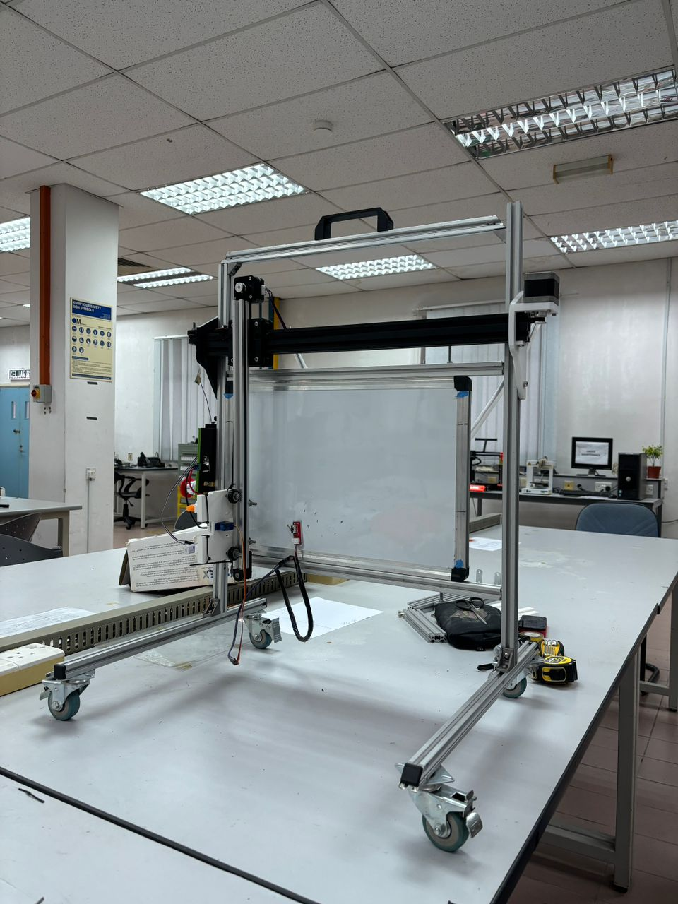

# Text-Voice-Prompt-Controlled-Whiteboard-Writer
The Prompt/Voice-Controlled Whiteboard Writer is a CNC-based automation system that writes and erases on a whiteboard using voice and text prompts. Powered by an ESP32 and integrated with Python-based AI, OCR, cloud upload, and a modular motion system, it enables accessible interaction for classrooms, offices, and users with physical limitations. Designed to be cost-efficient, user-friendly, and highly modular.

## Technologies & Hardware Used
- ESP32 (via Makerbase MKS DLC32)
- Stepper motors (NEMA 17)
- MG996R servo
- USB camera + microphone
- Python, OpenCV, Vosk API
- Google Drive API
- CNC-style gantry frame (aluminium)
  
## Project Structure
- `whiteboard.py`  
  The overall system which integrates all the functions.
- `write_module.py`  
  Handles the writing functions.
- `erase_module.py`  
  Manages the erasing functions.
- `gcode_data.py`  
  Contains all the G-code commands used for the writing module.
- `config.json`
  Saves all the calibration values for the writing and erasing head.
- `requirements.txt`  
  Lists all Python dependencies required for the project.
- `token.json` `IDPcredentials.json`
  Both these files are needed to access the Google Drive for screenshot sharing

## Getting Started
1. Clone the repository:
   ```bash
   git clone https://github.com/DefNotIrf/Text-Voice-Prompt-Controlled-Whiteboard-Writer.git
   cd Text-Voice-Prompt-Controlled-Whiteboard-Writer
2. Download the required libraries listed in 'requirements.txt'
3. Download the 'vosk-model-small-en-us-0.15' from their website: https://alphacephei.com/vosk/models, extract it and place it in a folder labelled 'models'

## System Preview



> *Voice-prompted whiteboard writer in action — portable, modular, and AI-integrated.*

---

## Final Report

You can read the full technical documentation here:
👉 [IDP Final Report (PDF)](docs/IDP Project Report G6.pdf)


## Contributors
Muhammad Irfan, Tengku Muhammad Afnan Faliq, Syabab Alhaqqi, Asyraaf Aiman

## License
This project is licensed under the MIT License. See [LICENSE](./LICENSE) for details.

